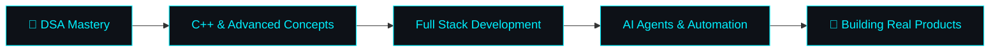

  

<h3 align="center">
  
</h3>

  
  
  
  

  

## 🌌 About Me

  

I like turning ideas into working software — from client websites and full-stack applications to AI-powered experiments and developer automation. I am a **B.Tech Computer Science Engineering student** constantly exploring the intersection of modern web development and Generative AI.

- 💻 **Building:** Real-world full-stack applications and AI-driven platforms.
- 🧠 **Exploring:** Advanced Data Structures & Algorithms, AI Agents, MCP, and Local AI.
- 🚀 **Mission:** Creating scalable software that solves genuine problems.
- ☕ **Fun Fact:** Debugging until it works is my favorite pastime!

  

## 🛠️ Tech Stack & Arsenal

  <strong><samp>Languages</samp></strong> 
  

  <strong><samp>Frontend</samp></strong> 
  

  <strong><samp>Backend & Databases</samp></strong> 
  

  <strong><samp>Tools & Platforms</samp></strong> 
  

  <strong><samp>AI Models & Environments</samp></strong> 
  
  
  

  

## 🚀 Featured Projects

| Project | Description | Tech Stack | Links |
| :--- | :--- | :--- | :--- |
| **[Satya Sports](https://github.com/Bhaskar-tech1/Satya-Sports)** | Real-world client project for a sports goods dealer. Features product browsing, admin functionality, cart, and smooth animations. | `<HTML/CSS/JS>` `<Tailwind>` `<Firebase>` `<GSAP>` | [Repo](https://github.com/Bhaskar-tech1/Satya-Sports) |
| **[VB Collections](https://github.com/Bhaskar-tech1/VB-Collections)** | E-commerce platform for a jewelry business with product categories, shopping cart, and a responsive mobile-first interface. | `<HTML/CSS/JS>` `<Supabase>` `<Cloudinary>` | [Repo](https://github.com/Bhaskar-tech1/VB-Collections) |
| **[Hospital Bed Mgt](https://github.com/Bhaskar-tech1/hospital-beds)** | Full-stack platform tracking floor-wise bed availability in real-time with secure role-based access control. | `<Node.js>` `<Express>` `<SQLite>` `<Tailwind>` | [Repo](https://github.com/Bhaskar-tech1/hospital-beds) |
| **[Ride Easy](https://github.com/Bhaskar-tech1/rideeasy)** | A seamless ride-sharing and transportation platform focusing on user experience, responsive design, and robust routing functionality. | `<Web Stack>` `<Mapping/Routing>` `<Firebase>` | [Repo](https://github.com/Bhaskar-tech1/rideeasy) |

  

## 🧠 Continuous Learning Journey

  

  

  

<h4 align="center">Thanks for dropping by! Let's build something awesome together. 🚀</h4>
